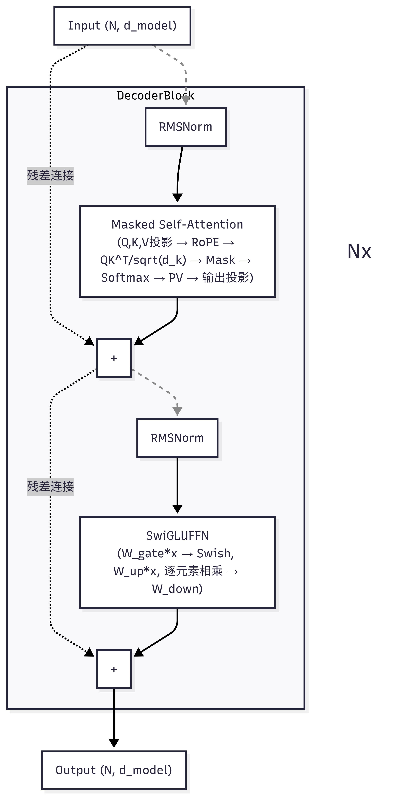
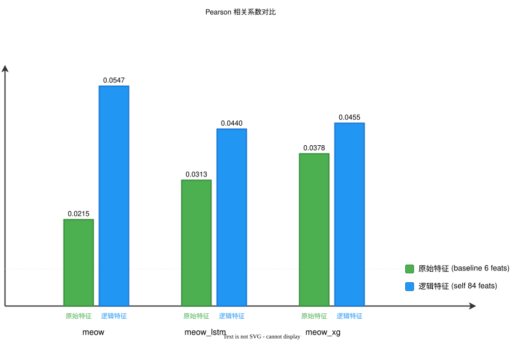
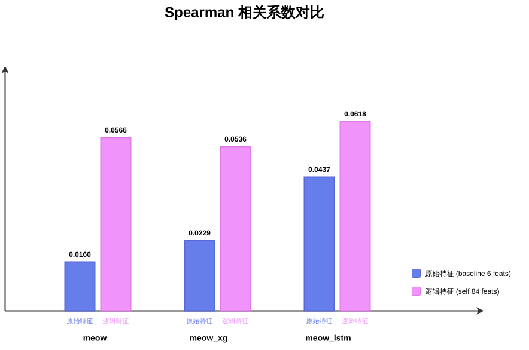
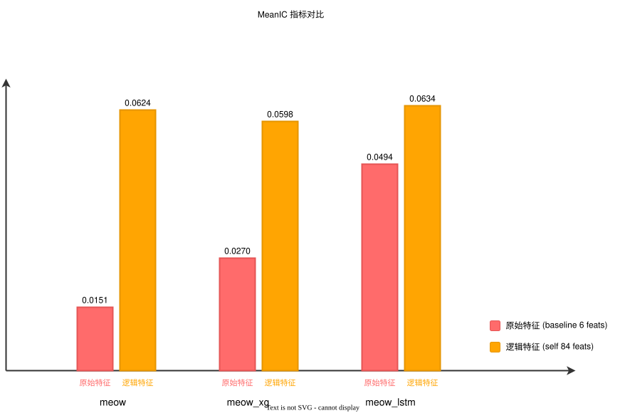
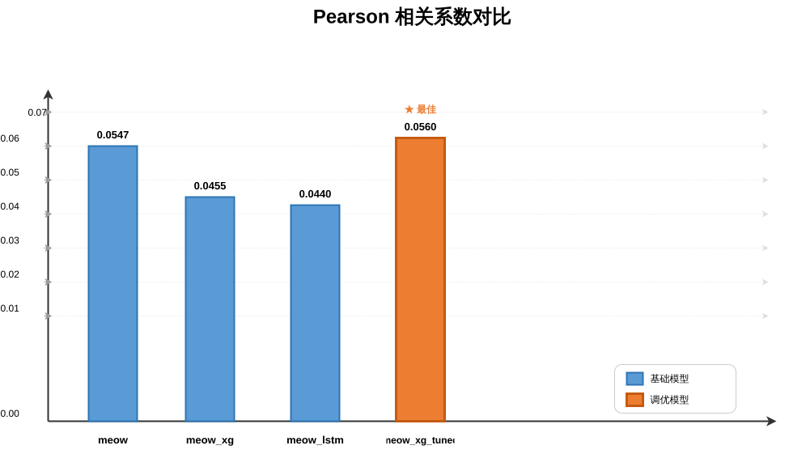
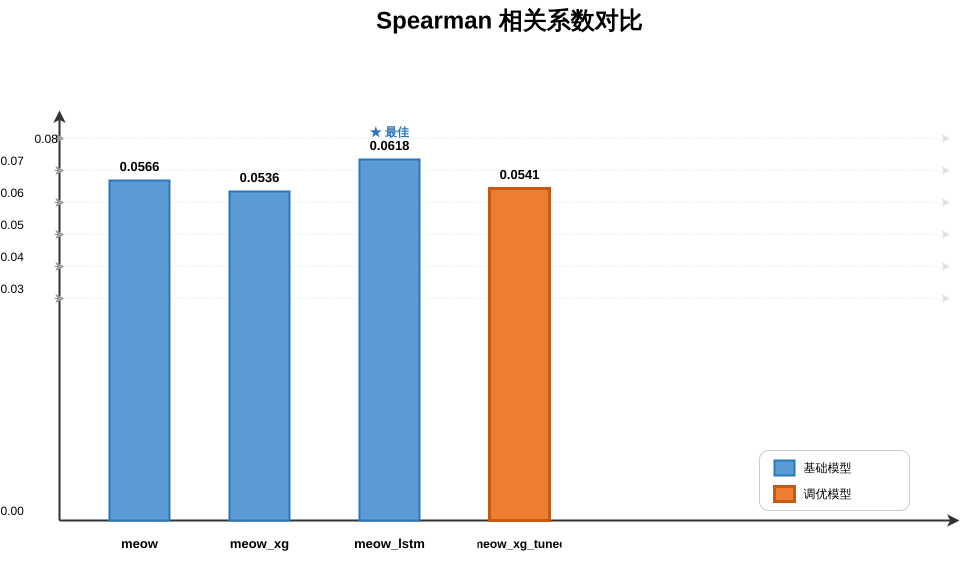
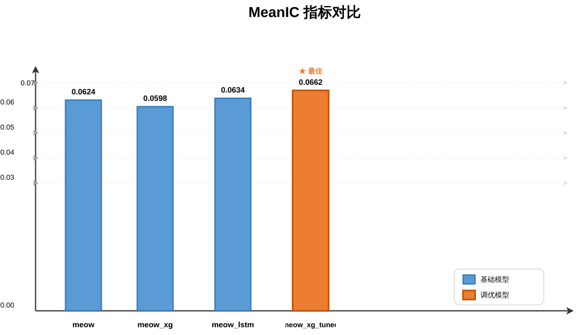

# Meow 金融时序预测分析

## Introduction

我们对比分析了多个模型的测试结果，并且最终通过特征工程以及超参搜索，提供了我们最为出色一款模型。没错，这个项目实际上是我们团队成员为了完成课业才开发的。不过在这个过程中，我们确实收获了很多。

在下面的详细介绍中，我们希望你能够理解我们的特征工程，这是我们的一大特色。并且我们在做了很多模型的基础上得出使用基于决策树的模型比如 **XGBoost** 或者 **LightGBM** 可以获得更为出色的结果。

其中吴天烨、张家树负责 **baseline** 部分的处理和基于 **XGBoost** 的模型以及它的超参搜索，张家树提供的特征工程方法产生了较多的特征，在这基础上测试了使用这些“新”特征获得的结果。汪建诺负责在多个模型的综合基础上进行优化（采用结构更加良好的 **LightGBM** ），对特征的数量进行了缩减，同时采用更加优秀的硬件，使得梯度可以稳步下降。吴同样对深度学习模型做了出色的探索。

你可能会好奇，我们为什么没有采用较为火热的深度学习模型，我们当然也尝试了例如 **PatchTST** 模型，但是受限于硬件以及数据集，我们并没有得到很好的效果。但是我们并没有放弃，在这期间，我们同样做了大量的工作，后面我们也会介绍。吴同学搭建的 **Decoder-only Transformer** 模型取得了出色的效果。

如果你想要快速使用我们的模型，可以运行一下命令：

1. 原始特征

```bash
### meow
python3 meow/meow.py

### meow_lstm
python3 meow_lstm/meow_lstm.py --train-start 20230601 --train-end 20231031 --test-start 20231101 --test-end 20231229

### meow_xg
python3 meow_xg/meow_xg.py  --train-start 20230601 --train-end 20231031 --test-start 20231101 --test-end 20231229
```

2. 逻辑特征

```bash
### meow
python3 meow/meow.py  --feature-set self

### meow_lstm
python3 meow_lstm/meow_lstm.py  --feature-set self --train-start 20230601 --train-end 20231031 --test-start 20231101 --test-end 20231229

### meow_xg
python3 meow_xg/meow_xg.py  --feature-set self  --train-start 20230601 --train-end 20231031 --test-start 20231101 --test-end 20231229
```

3. 金融特征 + LightBGM

```bash
python3 meow_lgbm/meow.py  --feature-set self
```


## Models

我们首先拉取了官方提供的基础线性模型，同时检索了金融时序预测相关的热门模型。最终我们锁定使用**线性模型**、**长短期记忆网络模型（ LSTM ）**、 **XGBoost 模型**以及 **LightGBM 模型**。在这些模型基础上，我们首先利用官方代码提供的最基础的数据集使用方法去做了 BaseLine 。在 BaseLine 的基础上，我们对比分析了特征工程之后，我们的模型效果得到了显著的提升。这一部分我们主要还是希望介绍模型的搭建以及衡量标准。具体的细节请参考 **Details** 一节。


### 原始/基础特征

原始数据使用的是 baseline 6 个特征：

| 特征名          | 含义 / 计算方式                                              |
| --------------- | ------------------------------------------------------------ |
| `ob_imb0`       | 一档盘口不平衡：$(asize0-bsize0)/(asize0+bsize0)$            |
| `ob_imb4`       | 0-4 档盘口不平衡：$(asize0_4-bsize0_4)/(asize0_4+bsize0_4)$  |
| `ob_imb9`       | 5-9 档盘口不平衡：$(asize5_9-bsize5_9)/(asize5_9+bsize5_9)$  |
| `trade_imb`     | 主买主卖成交量不平衡：$(tradeBuyQty-tradeSellQty)/(tradeBuyQty+tradeSellQty)$ |
| `trade_imbema5` | `trade_imb` 的 EMA 平滑，`halflife=5`                        |
| `lagret12`      | 12 阶滞后收益去截面均值后的残差收益                          |

### 特征工程（包含调优后的）

利用现有的数据生成的84维特征，具体细节参考 **Details/特征工程** 。84维的特征主要基于数据特征之间的逻辑，而调优后的特征则是基于金融动机。后者不仅在训练的时候占用更少的空间，同时包含了更加丰富的信息、更针对性的分类。我们将84维的特征称为逻辑特征。调优后的特征称为金融特征。


### 模型的成本函数

我们的成本函数主要使用均方误差，并没有对参数的大小进行限制。不过我们最终的优化模型`meow_lgbm`采用了`Adam`作为优化器。


### Decoder-Only Transformer

下面是该模型的结构示意图。



### 关键组件

| 组件 | 描述 | 参数量 |
|---|---|---|
| 门控特征选择 | 每个输入特征的可学习 sigmoid 门，带 L1 稀疏惩罚 | $F$ |
| 特征投影 | Linear(94 → 256) | ~24K |
| 股票嵌入 | Linear(500 → 16) → Linear(16 → 256)，单 ID 编码 | ~12K |
| CrossStockAttention | 每个时间步的跨股票多头注意力；$(B,T,D) \rightarrow (T,B,D)$ | ~0.4M |
| DecoderBlock × 3 | Pre-Norm RMSNorm + 因果注意力 + RoPE + 局部窗口 + SwiGLU FFN | ~5.7M |
| 输出头 × 4 | 每个 horizon 一个 Linear(256 → 1) + Linear(94 → 1) 跳跃连接 | ~1.3K |
| log_scale | 可学习的全局输出尺度因子 (exp(0) = 1.0) | 1 |
| **总计** | | **~6.2M** |

## 设计方法

1. Vol20 归一化（Volatility-Aware Target Normalization）

借鉴金融计量经济学中 GARCH 类模型的思想，目标变量（前向收益）按每只股票本地波动率进行归一化：

$$y_{\text{train}} = \frac{\text{fret12}}{\max(|\text{vol20}|, \text{vol20}_{\text{p05}})}$$

其中 $\text{vol20}$ 是 ret1 的 20 期滚动标准差。推理时进行去归一化：

$$\hat{y}_{\text{raw}} = \hat{y}_{\text{model}} \times \max(|\text{vol20}|, \text{vol20}_{\text{p05}})$$

这样做的效果类似于**风险调整收益**：模型学习预测「ret1 相对于 20 期波动率是几个标准差」，而非原始的绝对价格变动。高波动率股票不再主导损失函数——解决高频金融数据中的**异方差性**（heteroskedasticity）问题。

2. RoPE 旋转位置编码（Rotary Position Embedding）

与传统的加法正弦位置编码不同，RoPE通过**乘法**将位置信息注入注意力机制：

$$\text{RoPE}(q, m) = q \cdot e^{im\theta}$$

关键性质：$\langle \text{RoPE}(q_m), \text{RoPE}(k_n) \rangle$ 只依赖于相对位置 $m - n$，而非绝对位置 $m$ 和 $n$。这使得模型天然具有**相对位置感知**和**长度外推**能力，对于可变长度的日内交易序列尤为重要。

3. 多 horizon 预测头（Multi-Horizon Heads with Auxiliary Loss）

共享 Transformer backbone，带 4 个独立预测头：

```
                    ┌→ head_fret1  (1-step,  高噪声)
Transformer shared ──┼→ head_fret6  (6-step,  中等信号)
                    ├→ head_fret12 (12-step, 主要目标)
                    └→ head_fret24 (24-step, 时序最平滑)
```

这是借鉴了**多任务学习**和时序预测中的**多 horizon 策略**。共享的 backbone 被迫学习对所有 horizon 都有效的表示——这充当了天然的正则化器。短 horizon 提供更密集的梯度信号（样本更多），长 horizon 提供更平滑的优化 landscape。

4. 混合损失函数（Hybrid Loss: MSE + Pearson）

$$\mathcal{L} = \underbrace{\frac{1}{N}\sum(p_i - y_i)^2 / \text{Var}(y)}_{\text{MSE (scale accuracy)}} + \underbrace{0.5 \cdot \left(-\frac{\text{Cov}(p, y)}{\sigma_p \sigma_y}\right)}_{\text{Pearson Correlation (ranking quality)}}$$

两类损失量级相似（均归一化至 O(1)）：
- **MSE** 驱动预测尺度精度——直接优化 $R^2$
- **Pearson** 驱动截面排名质量——直接优化交易信号

这种设计直接回应了金融预测的核心矛盾：准确的排名（买入哪些股票）比精确的尺度（预测变动多少）更重要。传统的纯 MSE 训练会因极度噪声的收益分布而导致梯度消失；纯 Pearson 训练虽然排名好但预测尺度任意。混合损失平衡了两者。

5. Pre-Norm 残差连接 + RMSNorm

每个 DecoderBlock 使用 **Pre-Norm** 模式（先归一化，后计算）：

$$x \leftarrow x + \text{Sublayer}(\text{RMSNorm}(x))$$

与 Post-Norm（原始 Transformer）对比，Pre-Norm 在训练初期不稳定时提供更平滑的梯度流动。使用**RMSNorm**（而非 LayerNorm）将归一化计算的参数量减少了一半，同时保持等价效果。

6. SwiGLU 前馈网络

$$\text{FFN}(x) = W_{\text{out}} \cdot (\text{SiLU}(W_{\text{gate}} \cdot x) \odot W_{\text{up}} \cdot x)$$

SwiGLU通过门控线性单元提供比标准 ReLU-FFN 更丰富的非线性表示能力，在相同参数预算下表现更好。

7. 混合精度训练（Mixed Precision Training）

使用 `torch.amp.autocast("cuda")` 进行自动混合精度训练——前向和反向传播的大部分计算在 FP16 下进行，关键步骤（如 softmax、loss）保持在 FP32。GradScaler 处理梯度下溢。这在 RTX 4060 8GB 上~6.2M 参数的模型中提供了约 1.5× 的加速比。

## Results

这一部分我们将直观的展示我们在模型优劣上的探索，以及最优模型的结果。下面的这些衡量标准具体请参考**Details/衡量标准**。

### BaseLine


| 模型        | 特征             | Pearson | Spearman |       R2 |  MSE | MeanIC | MeanRankIC |
| ----------- | ---------------- | ------: | -------: | -------: | ---: | -----: | ---------: |
| `meow`      | baseline 6 feats |  0.0215 |   0.0160 |  0.00034 | 0.00 | 0.0151 |     0.0102 |
| `meow_xg`   | baseline 6 feats |  0.0313 |   0.0229 |  0.00002 | 0.00 | 0.0270 |     0.0207 |
| `meow_lstm` | baseline 6 feats |  0.0378 |   0.0437 | -0.00553 | 0.00 | 0.0494 |     0.0597 |


### 特征工程效果

| 模型            | 特征                          | Pearson | Spearman |       R2 |  MSE | MeanIC | MeanRankIC |
| --------------- | ----------------------------- | ------: | -------: | -------: | ---: | -----: | ---------: |
| `meow`          | self 84 feats                 |  0.0547 |   0.0566 |  0.00280 | 0.00 | 0.0624 |     0.0629 |
| `meow_xg`       | self 84 feats                 |  0.0455 |   0.0536 | -0.00907 | 0.00 | 0.0598 |     0.0619 |
| `meow_lstm`     | self 84 feats                 |  0.0440 |   0.0618 | -0.09539 | 0.00 | 0.0634 |     0.0746 |
| `meow_xg_tuned` | self 84 feats + tuned XGBoost |  0.0560 |   0.0541 |  0.00160 | 0.00 | 0.0662 |     0.0620 |

<div style="display: flex; justify-content: space-between;">
  
  
  
</div>


通过几个关键标准的对比我们发现经过特殊处理的特征的效果明显要优于原始特征。


### 模型探索

我们对这几个模型做了横向对比后发现基于决策树的模型通常比其他模型更加的稳定而且效果出色。

<div style="display: flex; justify-content: space-between;">
  
  
  
</div>


因此，我们在 **XGBoost** 模型基础上做了进一步优化。我们为了让训练更加的充分，将逻辑特征替换为了更具金融含义的金融特征。在这个基础上，我们提出了使用优势更加明显的 **LightGBM** 模型。效果也很明显，Pearson 系数到达了 $7.75\%$ 。

除此之外的深度学习模型的探索中，吴的模型的 Pearson 系数达到了惊人的 $9.77\%$ 。


## Discussion

我们通过消融实验以及横向对比，锁定了我们的目标模型以及特征工程的使用。但是很遗憾的是，我们没有对优势模型例如 **LightGBM** 做消融实验，这也在我们未来的可更新范围内。


## Details


### 特征工程

#### 1. 原有数据的特征

| 字段名                                 | 含义                                       |
| :------------------------------------- | :----------------------------------------- |
| `midpx`                                | 中间价 = (bid0 + ask0)/2，代表当前公允价格 |
| `lastpx`                               | 最后一笔成交价                             |
| `open/high/low`                        | 当前 interval 内的 OHLC                    |
| `bid0/ask0`                            | 买一/卖一价格                              |
| `bsize0/asize0`                        | 买一/卖一数量                              |
| `bsize0_4 / asize0_4`                  | 买一到买五 / 卖一到卖五的总数量            |
| `btr0_4 / atr0_4`                      | 买一到买五 / 卖一到卖五的总金额            |
| `tradeBuyQty / tradeSellQty`           | 主买 / 主卖交易量                          |
| `tradeBuyTurnover / tradeSellTurnover` | 主买 / 主卖成交额                          |
| `buyVwad / sellVwad`                   | 买单 / 卖单从下单到成交的加权平均时间      |
| `addBuyQty / addSellQty`               | 新增买单 / 卖单数量                        |
| `cxlBuyQty / cxlSellQty`               | 撤单买单 / 卖单数量                        |

这些字段已经涵盖了 **order book、交易、订单流** 等核心信息。


#### 2. 逻辑特征

**价格与收益类特征**

| 特征             | 含义                                         | 理由                                      |
| ---------------- | -------------------------------------------- | ----------------------------------------- |
| `ret1/2/5/10/20` | 过去 1/2/5/10/20 个 interval 的收益率        | 捕捉**动量/反转效应**，多窗口适应不同频率 |
| `logret1`        | 对数收益率                                   | 更适合统计建模，接近正态分布              |
| `hl_range`       | (high - low) / midpx                         | 表示**波动性**，波动率变化会影响短期价格  |
| `oc_ret`         | (midpx - open) / open                        | 捕捉当前 interval 内的开盘到当前走势      |
| `lagret12`       | 过去 12 个 interval 的收益率（去掉截面均值） | 去除市场整体趋势，保留个股特异性信号      |

**市场微观结构类特征**

| 特征                   | 含义                       | 理由                                             |
| ---------------------- | -------------------------- | ------------------------------------------------ |
| `spread0` / `rspread0` | 买卖价差 / 相对价差        | 流动性指标，价差扩大通常预示不确定性增加         |
| `mid_last_gap`         | (lastpx - midpx) / midpx   | 最后一笔成交价与公允价格的偏离，反映短期成交压力 |
| `ob_imb0/4/9/19`       | 买卖盘不平衡度（不同深度） | 订单不平衡是短期价格变化的重要驱动因素           |
| `depth_sum0/4/9/19`    | 不同深度的总挂单量         | 反映市场深度和承接能力                           |

**交易行为类特征**

| 特征                                                 | 含义                          | 理由                                       |
| ---------------------------------------------------- | ----------------------------- | ------------------------------------------ |
| `trade_qty` / `trade_turnover`                       | 总成交量 / 总成交额           | 基础活跃度指标                             |
| `trade_imb` / `trade_imb_qty` / `trade_imb_turnover` | 主买 vs 主卖的 imbalance      | 主动买卖方向的不平衡直接推动价格           |
| `trade_imbema5`                                      | 交易 imbalance 的指数加权平均 | 平滑短期噪声，捕捉趋势                     |
| `buy_sell_vwad_gap`                                  | 买单与卖单的加权平均时间差    | 反映订单执行的 urgency，买单越快说明买压强 |
| `trade_range_buy/sell`                               | 主买/主卖的成交价范围         | 反映买卖双方的成交意愿分布                 |

**订单流（order flow）类特征**

| 特征                          | 含义                                               | 理由                                                     |
| ----------------------------- | -------------------------------------------------- | -------------------------------------------------------- |
| `add_imb_qty` / `cxl_imb_qty` | 新增/撤单的买卖不平衡                              | 新增订单代表新的交易意图，撤单代表犹豫或反转             |
| `net_ofi_qty`                 | 净订单流 = (addBuy - cxlBuy) - (addSell - cxlSell) | 经典的 Order Flow Imbalance 指标，是短期价格预测的强特征 |
| `net_ofi_turnover`            | 净订单流（按金额）                                 | 更贴近资金流向                                           |

**时间类特征**

| 特征                  | 含义                         | 理由                             |
| --------------------- | ---------------------------- | -------------------------------- |
| `tod_sin` / `tod_cos` | 日内时间（分钟）的正余弦编码 | 捕捉日内周期性，如开盘、收盘效应 |

**滚动统计、滞后、EWM 特征**

| 类型            | 例子                                | 理由                                  |
| --------------- | ----------------------------------- | ------------------------------------- |
| 滚动均值/标准差 | `ret1_mean5`, `trade_imb_qty_std10` | 捕捉短期趋势和波动性变化              |
| 滞后特征        | `trade_imb_qty_lag1`                | 自相关性，历史 imbalance 对未来有影响 |
| EWM             | `ret1_ewm10`                        | 对近期数据赋予更高权重，适应非平稳性  |

**横截面去均值特征**

| 例子                                                 | 理由                                             |
| ---------------------------------------------------- | ------------------------------------------------ |
| `ret1_cs` = ret1 - 当前 interval 所有股票的平均 ret1 | 去除市场共同因子，保留个股特异性信号，避免过拟合 |


#### 3. 金融特征

**Order Book Imbalance（订单簿不平衡）—— 13个特征**

| 特征名            | 计算方式                             | 含义                       | 设计理由                                 |
| ----------------- | ------------------------------------ | -------------------------- | ---------------------------------------- |
| `ob_imb0`         | (asize0 - bsize0) / (asize0+bsize0)  | 买一/卖一数量不平衡        | 最直接的短期供需压力，正负值预示价格方向 |
| `ob_imb4`         | (asize0_4 - bsize0_4) / (总和)       | 前五档总数量不平衡         | 反映更深的流动性分布，减少档位噪声       |
| `ob_imb9`         | (asize5_9 - bsize5_9) / (总和)       | 第6~10档数量不平衡         | 捕捉远离盘口的隐性压力                   |
| `ob_imb19`        | (asize10_19 - bsize10_19) / (总和)   | 第11~20档数量不平衡        | 极深档位的订单不平衡，可能预示大资金意图 |
| `ob_tr_imb0`      | (ask0*asize0 - bid0*bsize0) / (总和) | 买一/卖一金额不平衡        | 考虑价格权重，更能反映资金压力           |
| `ob_tr_imb4`      | (atr0_4 - btr0_4) / (总和)           | 前五档金额不平衡           | 深度加权的资金压力                       |
| `ob_tr_imb9`      | (atr5_9 - btr5_9) / (总和)           | 第6~10档金额不平衡         | 同上，远层资金压力                       |
| `ob_tr_imb19`     | (atr10_19 - btr10_19) / (总和)       | 第11~20档金额不平衡        | 极深层资金压力                           |
| `ob_spread`       | (ask0 - bid0) / midpx                | 相对买卖价差               | 流动性成本，价差扩大预示不确定性增加     |
| `ob_spread9`      | (ask9 - bid9) / midpx                | 第9档（远层）相对价差      | 深层流动性深度                           |
| `ob_midpx_pos`    | (midpx - bid0) / (ask0 - bid0)       | 中间价在买卖价内的相对位置 | 反映当前公允价格偏向买方还是卖方         |
| `ob_depth_ratio`  | (前五档总数量) / (前五档+第6~10档)   | 近层深度占比               | 流动性集中在近层还是远层，反映市场稳定性 |
| `ob_depth_ratio9` | (前五档) / (前五档+第6~20档)         | 近层深度占比（更广）       | 同上，更全面的深度分布                   |

> **理由**：订单簿的不平衡是短期价格变化的最直接驱动力之一。通过**多档位、数量/金额双重角度、深度比例**，可以更精细地刻画市场供需结构。

---

**Trade Flow（交易流）—— 7个特征**

| 特征名                | 计算方式                              | 含义                    | 设计理由                           |
| --------------------- | ------------------------------------- | ----------------------- | ---------------------------------- |
| `trade_imb`           | (buyQty - sellQty) / (总和)           | 主买/主卖成交量不平衡   | 主动成交方向，直接推动价格         |
| `trade_imbema5/20/60` | 不同半衰期的 EWMA                     | 平滑后的交易 imbalance  | 多时间尺度捕捉趋势，平滑噪声       |
| `trade_turnover_imb`  | (buyTurnover - sellTurnover) / (总和) | 主买/主卖成交金额不平衡 | 金额加权，更反映资金强度           |
| `trade_count_imb`     | (nTradeBuy - nTradeSell) / (总和)     | 主买/主卖订单笔数不平衡 | 笔数反映参与度，避免大单主导的偏差 |
| `trade_intensity`     | nTradeBuy + nTradeSell                | 总交易笔数              | 市场活跃度，高活跃度时信息更丰富   |

> **理由**：交易流反映了**已经发生的成交行为**，是订单簿不平衡的“结果”同时也是未来趋势的“原因”。多个时间尺度的 EWMA 可以适应不同频率的动量/反转模式。

---

**Order Flow（订单流：新增/撤单）—— 8个特征**

| 特征名            | 计算方式                                       | 含义                   | 设计理由                                            |
| ----------------- | ---------------------------------------------- | ---------------------- | --------------------------------------------------- |
| `add_imb`         | (addBuy - addSell) / (总和)                    | 新增买单/卖单的不平衡  | 新增订单代表**新的交易意图**，领先于成交            |
| `add_imbema5`     | 半衰期5的 EWMA                                 | 平滑后的新增 imbalance | 捕捉新增订单的趋势                                  |
| `cxl_imb`         | (cxlBuy - cxlSell) / (总和)                    | 撤单不平衡             | 撤单反映**犹豫或反向意图**，高位撤买单可能预示下跌  |
| `cxl_imbema5`     | 半衰期5的 EWMA                                 | 平滑后的撤单 imbalance | 同上                                                |
| `net_order_flow`  | [(addBuy-cxlBuy) - (addSell-cxlSell)] / 总流量 | 净订单流（标准化）     | 经典的 OFI 指标，已被大量实证证明对短期价格有预测力 |
| `cancel_rate`     | (cxlBuy+cxlSell) / (addBuy+addSell)            | 撤单率                 | 高撤单率表示市场不确定性强或流动性虚假              |
| `add_trade_ratio` | (新增量) / (成交量)                            | 新增订单与成交量的比值 | 反映挂单 vs 成交的比率，高比值说明挂单堆积          |
| `cxl_trade_ratio` | (撤单量) / (成交量)                            | 撤单与成交量的比值     | 高比值说明大量订单被取消，可能预示反转              |

> **理由**：订单流（尤其是新增和撤单）比成交更领先。`net_order_flow` 是高频金融中非常著名的预测因子。撤单率等特征可以识别**虚假流动性**或**订单试探行为**。

---

**Price Momentum（价格动量）—— 6个特征**

| 特征名         | 计算方式                                  | 含义                                 | 设计理由                                         |
| -------------- | ----------------------------------------- | ------------------------------------ | ------------------------------------------------ |
| `bret1/5/12`   | (midpx - midpx.shift(k)) / midpx.shift(k) | 过去 1/5/12 个 interval 的简单收益率 | 捕捉不同长度的动量效应                           |
| `lagret1/5/12` | bretk - 同 interval 所有股票的平均 bretk  | **横截面去均值**后的收益率           | 去除市场共同趋势，保留个股特异性信号，避免过拟合 |

> **理由**：动量/反转效应是经典因子。通过横截面去均值，可以提取**相对强弱**，这是业内常用的操作。

---

**Volatility & Range（波动率与区间）—— 4个特征**

| 特征名           | 计算方式                 | 含义             | 设计理由                               |
| ---------------- | ------------------------ | ---------------- | -------------------------------------- |
| `price_range`    | (high - low) / midpx     | 相对价格区间     | 反映 interval 内的波动剧烈程度         |
| `realized_vol5`  | bret1 的 5 期滚动标准差  | 短期实现波动率   | 波动率聚集效应，高波动往往伴随价格变动 |
| `realized_vol12` | bret1 的 12 期滚动标准差 | 中期实现波动率   | 不同时间尺度的波动率                   |
| `spread_ema12`   | ob_spread 的 EWMA(12)    | 平滑后的相对价差 | 流动性风险的持续性度量                 |

> **理由**：波动率本身可以预测未来收益（风险溢价），且波动率变化往往领先价格变化。

---

**Volume（成交量）—— 4个特征**

| 特征名            | 计算方式                         | 含义                     | 设计理由                                     |
| ----------------- | -------------------------------- | ------------------------ | -------------------------------------------- |
| `total_trade_qty` | tradeBuyQty + tradeSellQty       | 总成交数量               | 基础活跃度                                   |
| `rel_trade_qty`   | total_trade_qty / (前五档总数量) | 相对成交量（与挂单量比） | 成交相对于流动性的比例，高比值说明交易冲击大 |
| `buy_qty_ratio`   | tradeBuyQty / total_trade_qty    | 主买占比                 | 简单买卖方向比例                             |
| `total_qty_ema12` | total_trade_qty 的 EWMA(12)      | 平滑后的成交量           | 捕捉成交量趋势                               |

> **理由**：成交量是确认价格运动的重要辅助指标，相对成交量可以衡量**交易冲击**。

---

**Cross-sectional Features（横截面特征）—— 5个特征**

| 特征名       | 来源列            | 计算方式                           | 含义                                     | 理由                                       |
| ------------ | ----------------- | ---------------------------------- | ---------------------------------------- | ------------------------------------------ |
| `cs_imb0`    | `ob_imb0`         | 按 interval 分组，计算百分位数排名 | 当前股票在订单簿 imbalance 上的相对位置  | 横截面排名消除了绝对数值差异，突出相对机会 |
| `cs_bret12`  | `bret12`          | 同上                               | 过去12期收益率的相对排名                 | 捕捉相对动量                               |
| `cs_volume`  | `total_trade_qty` | 同上                               | 成交量的相对排名                         | 相对活跃度                                 |
| `cs_add_imb` | `add_imb`         | 同上                               | 新增订单 imbalance 的相对排名            | 相对订单流压力                             |
| `cs_spread`  | `ob_spread`       | 同上                               | 相对价差的排名（注意：排名越高价差越大） | 相对流动性成本                             |

> **理由**：横截面特征（也称为“相对排名”或“百分位特征”）是量化中非常常用的技巧，它可以消除不同股票之间因市值、波动性等固有差异带来的偏差，使模型更关注**当前时刻的相对强弱**。这里使用了 `rank(pct=True)` 而非简单的去均值，更稳健。


**总结优点**

1. **特征分类清晰，覆盖全面**

- 订单簿（多档位、数量/金额、深度比例）
- 交易流（多时间尺度 EWMA、笔数与金额）
- 订单流（新增、撤单、净流量、撤单率）
- 动量（多周期 + 横截面去均值）
- 波动率与成交量
- 横截面排名

2. **强调领先指标**

- 订单流（`add_imb`, `cxl_imb`, `net_order_flow`）比成交更领先
- 深度比例、撤单率等特征可以识别**虚假流动性**或**订单试探行为**

3. **多时间尺度适应非平稳性**

- 使用 EWMA 的不同半衰期（5/20/60）来捕捉短期、中期、长期趋势
- 滚动波动率（5/12 期）

4. **横截面标准化策略丰富**

- 对动量采用了“减去截面均值”
- 对其他特征采用了“截面百分位数排名”
- 这两种方式都能有效去除市场共同因子，突出个股特异性信号

5. **计算高效，避免未来信息泄露**

- 所有滚动、EWMA、shift 操作都基于历史数据（`feat.py` 中没有显式分组，但原始数据假定已按时间排序）
- 横截面排名使用当前 interval 内的所有股票，属于同一时刻信息，无未来数据

6. **与84维特征的差异**

| 方面       | `feat_self.py`          | `feat.py`                                                    |
| ---------- | ----------------------- | ------------------------------------------------------------ |
| 特征总数   | ~50+                    | 47                                                           |
| 订单簿深度 | 多档 imbalance + 总深度 | 增加了金额加权 imbalance (`ob_tr_imb*`) 和深度比例           |
| 订单流     | 使用 OFI 净流量         | 额外增加了 `cancel_rate`, `add_trade_ratio`, `cxl_trade_ratio` |
| 动量处理   | 横截面去均值            | 横截面去均值 + 横截面排名（应用于其他特征）                  |
| 成交量特征 | 简单成交量 + 速率       | 增加了相对成交量、EWMA 成交量                                |
| 时间编码   | 正余弦 TOD              | 无（依赖横截面排名）                                         |
| 可解释性   | 强（逻辑驱动）          | 强（金融动机明确）                                           |


### 衡量标准

| 类别          | 指标名称            | 取值范围 | 好坏方向   | 适用场景                             |
| :------------ | :------------------ | :------- | :--------- | :----------------------------------- |
| **全局**      | Pearson             | \[−1,1]  | ↑ 越大越好 | 整体方向一致性，最常用               |
| **全局**      | Spearman            | \[−1,1]  | ↑ 越大越好 | 对异常值鲁棒                         |
| **全局**      | R²                  | (−∞,1]   | ↑ 越大越好 | 相对解释力                           |
| **全局**      | MSE                 | [0,+∞)   | ↓ 越小越好 | 绝对误差大小                         |
| **横截面 IC** | Mean IC             | \[−1,1]  | ↑ 越大越好 | 评估每个时刻的预测能力，**量化常用** |
| **横截面 IC** | Median IC           | \[−1,1]  | ↑ 越大越好 | 抗异常值版本                         |
| **横截面 IC** | Mean Rank IC        | \[−1,1]  | ↑ 越大越好 | 秩相关性版本                         |
| **横截面 IC** | Median Rank IC      | \[−1,1]  | ↑ 越大越好 | 抗异常值秩版本                       |
| **按股票**    | Mean Sym Pearson    | \[−1,1]  | ↑ 越大越好 | 评估个股内预测能力                   |
| **按股票**    | Median Sym Pearson  | \[−1,1]  | ↑ 越大越好 | 抗异常值版本                         |
| **按股票**    | Mean Sym Spearman   | \[−1,1]  | ↑ 越大越好 | 秩相关性版本                         |
| **按股票**    | Median Sym Spearman | \[−1,1]  | ↑ 越大越好 | 抗异常值版本                         |

